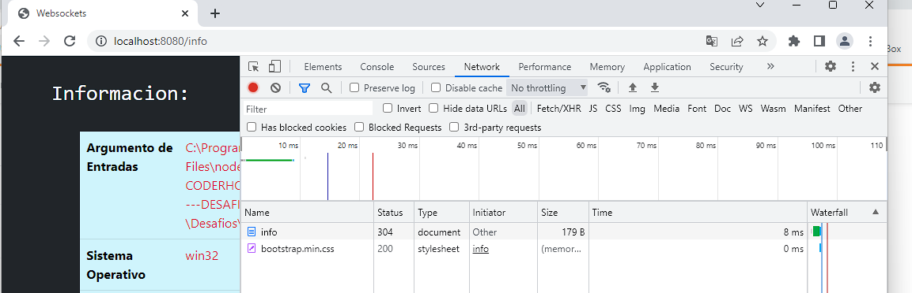
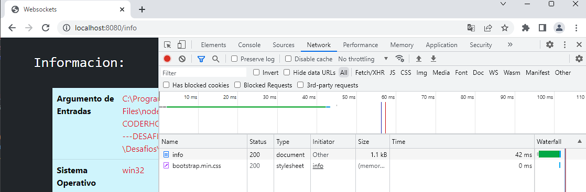
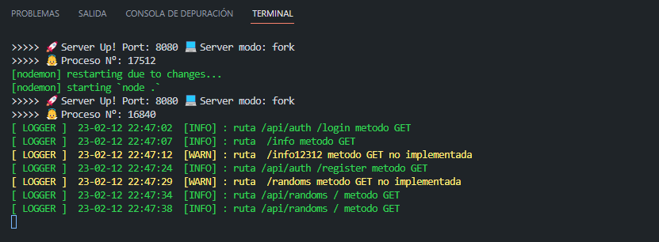

# Desafio 15 Curso Backend

## Loggers, gzip y analisis de perfomance

## Comenzamos:

### Ejecutar el proyecto:

Para ejecutar el proyecto, el mismo puede descargarse como .zip o git clone.

[Clic aqui para descargar repo formato zip](https://github.com/matsanchez/desafio15-backend/archive/refs/heads/main.zip)

Copiar y pegar en la terminal :

```
git clone https://github.com/matsanchez/desafio15-backend.git
```

> Instalar las dependencias:

```
npm install
```

> Poner a escuchar MySql:

```
Usando XAMPP Control Panel o el que utilices, siempre y cuando quieras realizar pruebas de autentificacion y uso de websockets, para el resto de las funciones no hace falta.
```

```
RESTOS DE LAS FUNCIONES:
EJ: http://localhost:8080 o .../info o .../api/randoms
```

> Modos de ejecucion Local:
>
> > Usando process

```
node .\src\app.js port (numero) modo (cluster o fork)
"Ej: node .\src\app.js port 8020 modo fork"

node .\src\app.js (por defecto se conecta al puerto 8080 y modo fork)
```

> > Usando Nodemon

```
npm run dev (modo developer) Nodemon --- por defecto usa puerto: 8080 modo: fork
```

```
Ingresas en el navegador http://localhost (si usas nginx)
Sino ingresas directamente a http://localhost:8080 o el puerto que hayas seleccionado
```

IMAGENES DE EJEMPLOS EJECUTADOS POR LINEA DE COMANDOS





```

Aclaracion: Se trabaja con variables de entorno, se sube el archivo .env solo a modo de ejercicio, el mismo nunca se deberia de subir a un repo por contener este mismo informacion sensible y confidencial.

En este caso, solo contiene informacion para dicho ejercicio, son datos de uso local(generalizados en todos)

```

```
Autor: Matias Sanchez
```
